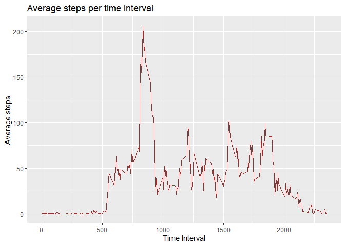

**This document contains the completed Reproducible Research Course Project1 for peer assessment.**


## Course Project Description
This assignment makes use of data from a personal activity monitoring device. This device collects data at 5 minute intervals through out the day. The data consists of two months of data from an anonymous individual collected during the months of October and November, 2012 and include the number of steps taken in 5 minute intervals each day.

### Commit containing full submission

1. Code for reading in the dataset and/or processing the data
2. Histogram of the total number of steps taken each day
3. Mean and median number of steps taken each day
4. Time series plot of the average number of steps taken
5. The 5-minute interval that, on average, contains the maximum number of steps
6. Code to describe and show a strategy for imputing missing data
7. Histogram of the total number of steps taken each day after missing values are imputed
8. Panel plot comparing the average number of steps taken per 5-minute interval across weekdays and weekends
9. All of the R code needed to reproduce the results (numbers, plots, etc.) in the report

## Loading and preprocessing the data
=====================================

### 1. Load the data

```r
unzip(zipfile="activity.zip") 

activity <- read.csv("activity.csv") ## Load the data

library(ggplot2)
library(dplyr)
```

```
## 
## Attaching package: 'dplyr'
```

```
## The following objects are masked from 'package:stats':
## 
##     filter, lag
```

```
## The following objects are masked from 'package:base':
## 
##     intersect, setdiff, setequal, union
```

### Basic structure of activity data

```r
dim(activity)
```

```
## [1] 17568     3
```

```r
names(activity)
```

```
## [1] "steps"    "date"     "interval"
```

```r
head(activity)
```

```
##   steps       date interval
## 1    NA 2012-10-01        0
## 2    NA 2012-10-01        5
## 3    NA 2012-10-01       10
## 4    NA 2012-10-01       15
## 5    NA 2012-10-01       20
## 6    NA 2012-10-01       25
```

```r
str(activity)
```

```
## 'data.frame':	17568 obs. of  3 variables:
##  $ steps   : int  NA NA NA NA NA NA NA NA NA NA ...
##  $ date    : chr  "2012-10-01" "2012-10-01" "2012-10-01" "2012-10-01" ...
##  $ interval: int  0 5 10 15 20 25 30 35 40 45 ...
```

## What is mean total number of steps taken per day?
====================================================

### 1. Calculate the total number of steps taken per day


```r
TotalStepsPerDay <- aggregate(activity$steps, list(activity$date), FUN=sum) ## Calculate the total number of steps per day

names(TotalStepsPerDay) <- c("Date", "Steps")  ## Assign the header name

head(TotalStepsPerDay)
```

```
##         Date Steps
## 1 2012-10-01    NA
## 2 2012-10-02   126
## 3 2012-10-03 11352
## 4 2012-10-04 12116
## 5 2012-10-05 13294
## 6 2012-10-06 15420
```

### 2. If you do not understand the difference between a histogram and a barplot, research the difference between them.  Make a histogram of the total number of steps taken each day


```r
ggplot(TotalStepsPerDay, aes(Steps)) + geom_histogram(boundary=0, binwidth=2500, col="darkgreen", fill="lightgreen")+ggtitle("Histogram of steps per day")+xlab("Steps Per Day")+ylab("Frequency") + scale_x_continuous (breaks=seq(0,25000,2500)) + scale_y_continuous (breaks=seq(0,18,2))
```

```
## Warning: Removed 8 rows containing non-finite values (stat_bin).
```

<!-- -->

### 3. Calculate and report the mean and median of the total number of steps taken per day


```r
mean(TotalStepsPerDay$Steps, na.rm = TRUE)  ## Mean of total number of steps taken per day
```

```
## [1] 10766.19
```
**The mean of total number of steps taken per day is 10766.19**


```r
median(TotalStepsPerDay$Steps, na.rm = TRUE)  ## Median of total number of steps taken per day
```

```
## [1] 10765
```
**The median of total number of steps taken per day is 10765**

## What is the average daily activity pattern?
==============================================

#### 1. Time series plot of the 5 minute interval (x) and averaged number of steps taken averaged across all days (y)


```r
AverageStepsPerTime <- aggregate (steps~interval, data=activity, FUN=mean, na.action=na.omit) ## create table with average steps per time

ggplot(AverageStepsPerTime, aes(interval, steps)) + geom_line(col="brown") + ggtitle ("Average steps per time interval") + xlab ("Time Interval") + ylab ("Average steps")  ## draw the line plot
```

<!-- -->

#### 2. 5-minute interval (on average across all the days) with the maximum number of steps


```r
AverageStepsPerTime[which.max(AverageStepsPerTime$steps), ]  ## Find the interval column with maximum value
```

```
##     interval    steps
## 104      835 206.1698
```

**The interval with maximum average number of steps is 835**

## Imputing missing values
==========================

#### 1. Total number of missing values in the dataset


```r
sum(is.na(activity))  ## count the number of missing values in the dataset
```

```
## [1] 2304
```

**The total number of missing values in the dataset is 2304**

#### 2. Replace missing values

CompleteSteps is the new column without missing values.


```r
activity$CompleteSteps <- ifelse(is.na(activity$steps), (AverageStepsPerTime$steps [match(activity$interval, AverageStepsPerTime$interval)]), activity$steps)  ## values without NA are imputed in a new column
```

#### 3. New dataset that is equal to the original dataset but with the missing data filled in


```r
activityFull <- data.frame(steps=activity$CompleteSteps, interval=activity$interval, date=activity$date) ## A new activity dataset with filled missing values

head(activityFull)
```

```
##       steps interval       date
## 1 1.7169811        0 2012-10-01
## 2 0.3396226        5 2012-10-01
## 3 0.1320755       10 2012-10-01
## 4 0.1509434       15 2012-10-01
## 5 0.0754717       20 2012-10-01
## 6 2.0943396       25 2012-10-01
```

#### 4a. Histogram of the total number of steps taken each day with missing data filled in


```r
TotalStepsPerDayFull <- aggregate(activityFull$steps, list(activityFull$date), FUN=sum) # data for histogram plot

colnames(TotalStepsPerDayFull) <- c("Date", "Steps") # data for histogram plot

ggplot(TotalStepsPerDayFull, aes(Steps)) + geom_histogram (boundary=0, binwidth=2500, col="darkblue", fill="lightblue") + ggtitle("Histogram of steps per day") + xlab("Steps per day") + ylab ("Frequency") + scale_x_continuous (breaks=seq(0,25000,2500)) + scale_y_continuous(breaks=seq(0,26,2))
```

<!-- -->

#### 4b. Calculate and report the mean and median total number of steps taken per day. Do these values differ from the estimates from the first part of the assignment? What is the impact of imputing missing data on the estimates of the total daily number of steps?


```r
mean(TotalStepsPerDayFull$Steps)  ## Mean of total number of steps taken per day from new database with filled missing value
```

```
## [1] 10766.19
```

**The mean of total number of steps taken per day from the new database with filled missing values is 10766.19**


```r
median(TotalStepsPerDayFull$Steps)  ## Median of total number of steps taken per day from new database with filled missing value
```

```
## [1] 10766.19
```

**The median of total number of steps taken per day from the new database with filled missing values is 10766.19**

Imputing missing values have no impact on the mean but there is a slight change in the median of the total daily number of steps. Watching the histogram we can note than the only bin that is changed is the interval between 10000 and 12500 steps, grown from a frequency of 18 to a frequency of 26.


## Are there differences in activity patterns between weekdays and weekends?
============================================================================

#### 1. Create a new factor variable in the dataset with two levels - “weekday” and “weekend” indicating whether a given date is a weekday or weekend day.

DayType is the new column indicating if the day is a weekday day or a weekend day


```r
activityFull$RealDate <- as.Date(activityFull$date, format = "%Y-%m-%d") ## Create a new variable with date in correct format

activityFull$weekday <- weekdays(activityFull$RealDate) ## Create a new variable "weekday" with weekday's name

activityFull$DayType <- ifelse(activityFull$weekday=='Saturday' | activityFull$weekday=='Sunday', 'weekend','weekday') ## create a new variable "DataType" indicating weekday or weekend

head(activityFull, n=10)
```

```
##        steps interval       date   RealDate weekday DayType
## 1  1.7169811        0 2012-10-01 2012-10-01  Monday weekday
## 2  0.3396226        5 2012-10-01 2012-10-01  Monday weekday
## 3  0.1320755       10 2012-10-01 2012-10-01  Monday weekday
## 4  0.1509434       15 2012-10-01 2012-10-01  Monday weekday
## 5  0.0754717       20 2012-10-01 2012-10-01  Monday weekday
## 6  2.0943396       25 2012-10-01 2012-10-01  Monday weekday
## 7  0.5283019       30 2012-10-01 2012-10-01  Monday weekday
## 8  0.8679245       35 2012-10-01 2012-10-01  Monday weekday
## 9  0.0000000       40 2012-10-01 2012-10-01  Monday weekday
## 10 1.4716981       45 2012-10-01 2012-10-01  Monday weekday
```

#### 2. Two time series plot of the 5-minute interval (x) and the average number of steps taken averaged across weekday days or weekend days (y).


```r
AverageStepsPerTimeDT <- aggregate(steps ~ interval + DayType, data=activityFull, FUN=mean, na.action=na.omit)  ## create table with steps per time across weekday days or weekend days

ggplot(AverageStepsPerTimeDT, aes(interval, steps)) + geom_line(col="darkred") + ggtitle ("Average steps per time interval: weekdays vs. weekends") + xlab("Time Interval") + ylab("Average steps") + facet_grid(DayType ~ .)
```

<!-- -->

